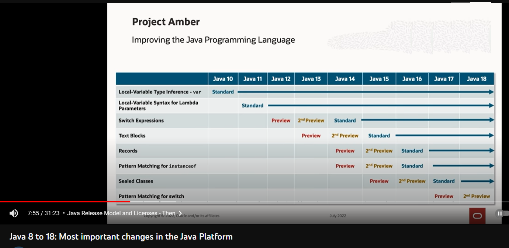

# java - Language Features from Java 9 to Java 18
This repo to test new java feature\

* Java 10
  * Local variable: Type Inference with var
* Java 14
  * switch expression: statement 
    * can be used as expression and return a value
    * a case statement can have multiple value
    * when using the arrow operator '->' no break is required (if the break is use, can of the older colon syntax)
* Java 15
  * Text blocks: feature to declare multi-line strings
* Java 16
  * Record: (preview in JDK14) introduced to reduce repetitive boilerplate code in data model POJOs
    * Records are similar to enums in the fact that they are a restricted form of class.
    * Defining a record is a concise way of defining an immutable data holding object.
  * Stream.toList(): to replace Stream.collect(Collectors.toList())
  * instanceof: pattern matching
* Java 17 
  * sealed (and non-sealed): specify which sub-classes are allowed to extend/implement, all inherit mush be marked with sealed/final/non-sealed
 
